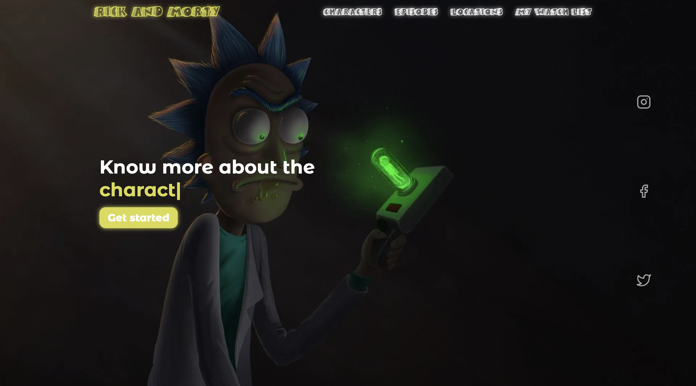

<h1 align="center">
   
  
   
  Rick and Morty
   
  <h4 align="center">Rick and Morty page using <a href="https://uk.reactjs.org/" target="_blank">React.js</a>
</h1>

> [Portfolio 👨‍💻](https://yuriy-kulakovskyi.github.io/Portfolio/) 
